# Metaloop Architecture

This describes the current component structure of the plugin, as of the merged
(post-refactor) codebase in `src/`.

## Overview

`Metaloop` (in `lib.rs`) is a `nih-plug` CLAP/VST3 plugin. Each audio block it
receives from the host is ticked sample-by-sample through a `GrainLooper`,
which is the core looping/scrubbing engine. `GrainLooper` combines a
beat-synced `LoopScheduler` (built on a generic `Scheduler<LoopEvent>`) that
decides *when* grains should start/stop/fade, a `GrainPlayer` that owns the
actual audio buffers and plays back `Grain`s, and a `TimeConverter` that
converts between beats and samples given the host's tempo and sample rate.

Audio samples flow through the plugin as `StereoPair<f32>` values, and
smoothed parameter transitions (dry/wet crossfades, per-grain fade envelopes)
are handled by `RampedValue`.

Separately, `Metaloop` also feeds a mono-summed, downsampled `DelayLine<WaveformBar>`
("waveform_buffer") purely for UI display purposes — this buffer is written
to directly in `process()`, outside of the `GrainLooper`, and is read by the
`ui` module's `WaveformDisplay` widget when the egui editor is drawn.

## Component diagram

```mermaid
graph TD
    DAW["DAW Host<br/>(audio buffer, transport/tempo, params)"]

    subgraph PluginMod ["Metaloop Plugin (lib.rs)"]
        ML["Metaloop<br/>(nih_plug::Plugin)"]
        MLP["MetaloopParams<br/>loop_length, loop_offset,<br/>loop, reverse, fade, speed"]
        WB["waveform_buffer:<br/>DelayLine&lt;WaveformBar&gt;"]
    end

    subgraph UIMod ["ui module (src/ui/)"]
        WD["WaveformDisplay<br/>(egui widget)"]
        MPS["MyParamSlider<br/>(egui widget, XY pad)"]
    end

    subgraph Engine ["GrainLooper&lt;T: AudioSampleOps&gt; (grain_looper.rs)"]
        GL["GrainLooper"]
        DRY["dry_ramp: RampedValue<br/>(dry/wet crossfade)"]
        TC["time: TimeConverter"]
    end

    subgraph SchedMod ["LoopScheduler (loop_scheduler.rs)"]
        LS["LoopScheduler"]
        LE["LoopEvent<br/>StartGrain | StartLegatoGrain<br/>StopGrain | FadeOutDry<br/>FadeInDry | NextLoop"]
    end

    subgraph GenSched ["Scheduler (scheduler.rs)"]
        SC["Scheduler&lt;LoopEvent&gt;<br/>beat-time event queue"]
    end

    subgraph Playback ["GrainPlayer&lt;T&gt; (grain_player.rs)"]
        GP["GrainPlayer"]
        BUFA["buffer_a: DelayLine&lt;T&gt;"]
        BUFB["buffer_b: DelayLine&lt;T&gt;"]
        GR["grains: Vec&lt;Grain&gt;<br/>(fixed pool, MAX_GRAINS = 10)"]
        WHICH["start_grains_buffer /<br/>frozen_buffer: WhichBuffer<br/>(A / B / Neither)"]
    end

    subgraph GrainMod ["Grain (grain.rs)"]
        G["Grain<br/>delay_pos, duration, speed,<br/>offset, reverse"]
        FR["fade_ramp: RampedValue"]
    end

    subgraph TimeMod ["TimeConverter (time_converter.rs)"]
        TCImpl["beats_to_samples() /<br/>samples_to_beats()"]
    end

    subgraph SupportTypes ["Support types"]
        SP["StereoPair&lt;f32&gt;<br/>(AudioSampleOps)"]
        RV["RampedValue<br/>(ramped_value.rs)"]
        DL["DelayLine&lt;T&gt;<br/>(delay_line.rs)<br/>circular buffer + interpolated read"]
    end

    DAW -->|"samples, beat_time, tempo"| ML
    ML -->|"owns"| MLP
    ML -->|"owns"| WB
    ML -->|".tick(input: StereoPair, beat_time)"| GL
    ML -->|"set_grid/set_loop_offset/<br/>set_reverse/set_fade_time/<br/>set_speed/set_tempo"| GL
    ML -->|"writes each block"| WB
    WB -->|"read by"| WD
    WD -.->|"used in"| UIMod
    MPS -.->|"used in"| UIMod
    ML -->|"builds egui editor with"| WD
    ML -->|"builds egui editor with"| MPS
    MPS -->|"sets params via ParamSetter"| MLP

    GL --> DRY
    GL --> TC
    TC -->|"instance of"| TCImpl
    GL -->|".tick(beat_time)"| LS
    LS -->|"LoopEvents"| GL
    LS -->|"schedules on"| SC
    LS -.->|"emits"| LE

    GL -->|".start_grain(Grain)"| GP
    GL -->|".tick(input)"| GP
    GL -->|".stop_all_grains() /<br/>initiate/uninitiate_looping_reference()"| GP

    GP --> BUFA
    GP --> BUFB
    GP --> WHICH
    GP -->|"owns pool"| GR
    GR -->|"contains"| G
    G --> FR

    BUFA -.->|"instance of"| DL
    BUFB -.->|"instance of"| DL
    FR -.->|"instance of"| RV
    DRY -.->|"instance of"| RV

    GP -->|"mixed grain output: T"| GL
    GL -->|"looped + dry * dry_level"| ML
    ML -->|"audio out"| DAW

    style DAW fill:#4a9eff,color:#fff
    style ML fill:#ff6b6b,color:#fff
    style GL fill:#ffa94d,color:#fff
    style LS fill:#69db7c,color:#fff
    style GP fill:#da77f2,color:#fff
    style G fill:#e599f7,color:#fff
    style DL fill:#74c0fc,color:#fff
    style SP fill:#868e96,color:#fff
    style RV fill:#868e96,color:#fff
    style WD fill:#20c997,color:#fff
    style MPS fill:#20c997,color:#fff
```

## Notes on specific relationships

- **`Metaloop` → `GrainLooper`**: `Metaloop::process()` ticks the looper once
  per sample with a `StereoPair<f32>` input and the current beat time
  (`GrainLooper<StereoPair<f32>>`, see `lib.rs`). Parameter updates
  (`update_params()`) push `set_grid`, `set_loop_offset`, `set_reverse`,
  `set_fade_time`, `set_speed`, and `set_tempo` down onto the looper every
  block while looping.
- **`GrainLooper` → `LoopScheduler` → `Scheduler<LoopEvent>`**: `GrainLooper::tick`
  calls `loop_scheduler.tick(beat_time)`, which internally ticks a generic
  `Scheduler<LoopEvent>` event queue and reinterprets `NextLoop` events into
  `StartGrain`/`FadeOutDry` events returned to `GrainLooper`.
- **`GrainLooper` → `GrainPlayer` → `{Grain, DelayLine x2}`**: in response to
  scheduler events, `GrainLooper::start_grain` constructs a `Grain` (with
  offset/duration/fade/reverse/speed derived via `TimeConverter`) and hands it
  to `GrainPlayer::start_grain`, which places it into a fixed pool
  (`MAX_GRAINS = 10`). `GrainPlayer` owns two `DelayLine<T>` buffers
  (`buffer_a`, `buffer_b`); it always writes incoming audio into whichever of
  the two is not currently frozen, and grains read from whichever buffer they
  were started on (`WhichBuffer`). This double-buffer scheme lets one buffer
  freeze as a stable "loop source" while the other keeps rolling with live
  input, so a scrub/offset change can read either a frozen loop region or
  fresh input without discontinuities.
- **`TimeConverter`**: owned by `GrainLooper` (and separately constructed
  per-block in `Metaloop::process` for UI-width calculations); converts
  beats to/from samples given `sample_rate` and `tempo`. `GrainLooper` uses it
  to translate beat-based grid/offset/fade parameters into sample offsets and
  durations when creating `Grain`s.
- **`StereoPair<f32>`**: the concrete sample type `GrainLooper`/`GrainPlayer`/
  `DelayLine` are instantiated with in `lib.rs`; implements `AudioSampleOps`
  (add/sub/mul/scale) so the generic grain/delay-line code works for stereo
  audio.
- **`RampedValue`**: used in two places — `GrainLooper::dry_ramp` for the
  dry/wet crossfade driven by `FadeInDry`/`FadeOutDry` events, and inside each
  `Grain` (`fade_ramp`) for its individual fade-in/fade-out envelope.
- **UI module (`src/ui/`)**: `Metaloop::editor()` builds an egui editor that
  reads `waveform_buffer` (a `DelayLine<WaveformBar>` filled directly in
  `process()`, independent of `GrainLooper`) via the `WaveformDisplay` widget,
  and reads/writes the loop offset/length/on-off params via the
  `MyParamSlider` widget (an XY pad that calls back into `ParamSetter`).
  There is no dependency from `ui` back into `GrainLooper`/`GrainPlayer` —
  the UI only ever sees the waveform buffer and the plugin's `Params`.
</content>
