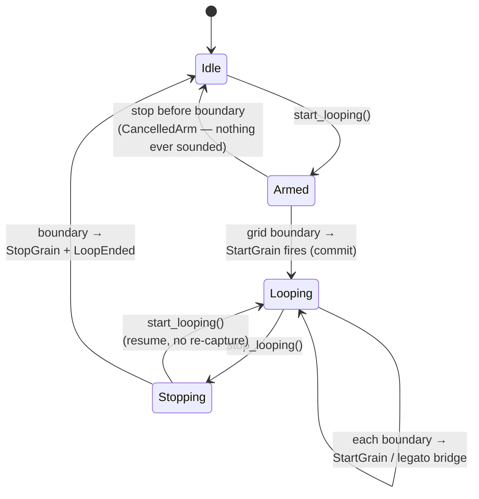
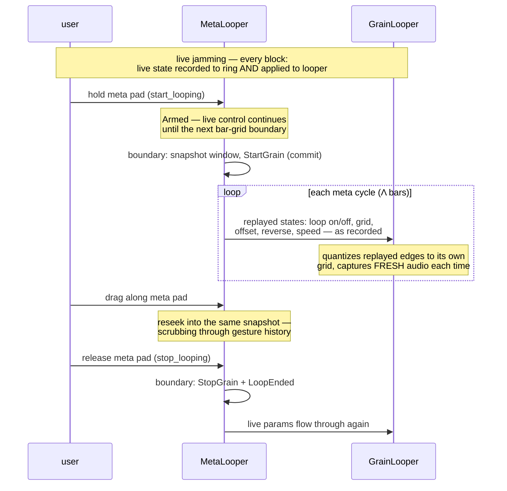

# Metalooping — design

*Status: planned, not yet implemented. Written 2026-07.*

The XY-pad gestures (offset, grid, loop on/off — plus reverse and speed) form
a beat-timed series that can itself be looped: a second XY pad with an 8-bar
window and divisions of 1/2/4/8 bars selects a window of recent **gesture
history** and replays it cyclically, driving the existing looper as if the
user were re-performing it. The audio is always fresh — the *gesture pattern*
is what loops. This is the feature the plugin is named for.

## The two decisions everything hangs on

**1. Replay states, not events.** This is the levels-not-edges lesson from the
loop-silence bug (see TODO.md history), applied one level up. We do *not* copy
scheduler events into a queue and re-fire them — copied future events would
need clearing and rescheduling on every meta grid change, recreating exactly
the orphaned-event bug class the state-machine refactor eliminated. Instead we
record the gesture **state** time series, and each tick look up "what was the
state at replayed time τ". Wraps, legato re-entry, and scrubbing all become
cursor seeks, and the state at the window edge is always well-defined (a
delta/event replay gets the wrap state wrong unless it separately tracks it).

**2. `LoopScheduler` is reused unchanged as the meta timing brain.** The
scheduler is already audio-agnostic: beat ticks in, `StartGrain` /
`StartLegatoGrain` / `StopGrain` / `LoopEnded` out, given a grid interval and
start/stop requests. A second instance with a bar-sized grid provides meta
start/stop quantization, cyclic re-triggering, shorten (cut + restart) and
lengthen (legato re-entry part-way through the window) — for free, already
tested.

## The audio ↔ meta analogy

| audio loop | meta loop |
|---|---|
| samples in `DelayLine` rolling buffer | `GestureState` changes in a ring |
| freeze / double-buffer (zero-copy, big data) | snapshot-on-commit (copy, tiny data) |
| `Grain` (up to 10, faded, overlapping) | one `Replay` cursor (discrete, no fades) |
| `GrainLooper` | `MetaLooper` |
| content `[b − o − L, b − o]` before the boundary | same, in the 32-beat gesture window |

Gestures are a few kilobytes, so the audio side's "no copying on the audio
thread" constraint doesn't bind here: snapshotting the window at meta-commit
(the simple design the audio side couldn't afford) replaces the entire
freeze/flip protocol. Replayed loops read **live** audio from the rolling
buffers — no audio is ever copied.

## Architecture

```mermaid
flowchart TD
    subgraph host [Host / GUI]
        P1[inner pad params<br/>offset, grid, loop]
        P2[meta pad params<br/>meta offset, meta grid, meta loop]
        RS[reverse, speed]
    end

    subgraph meta [MetaLooper &nbsp;*new*]
        LS2["LoopScheduler #2<br/>(reused unchanged,<br/>grid = 1–8 bars)"]
        RING[(GestureBuffer<br/>rolling ring of<br/>state changes)]
        SNAP[(GestureWindow<br/>32-beat snapshot,<br/>taken at commit)]
        REPLAY[Replay cursor<br/>state_at&#40;τ&#41;]
        LS2 -- StartGrain / Legato /<br/>StopGrain / LoopEnded --> REPLAY
        RING -- copy once<br/>at commit --> SNAP
        SNAP --> REPLAY
    end

    subgraph inner [GrainLooper &nbsp;*unchanged*]
        LS1["LoopScheduler #1<br/>(grid = 1/64–1/1 note)"]
        GP[GrainPlayer<br/>grains + rolling<br/>audio buffers]
        LS1 --> GP
    end

    P1 -- live GestureState --> RING
    P1 -- live GestureState --> SW{replaying?}
    P2 --> LS2
    RS -- part of GestureState --> RING
    REPLAY -- replayed GestureState --> SW
    SW -- one GestureState per block --> LS1
    AUDIO[audio in] --> GP --> OUT[audio out]
```



The `MetaLooper` composes *in front of* the `GrainLooper`: every process
block, the live params are folded into a `GestureState`, passed through
`meta_looper.tick(beat_time, live)`, and whatever comes out (live or replayed)
is applied to the inner looper exactly the way `update_params()` applies
params today. The inner looper cannot tell a replayed gesture from a live one,
and its idempotent start/stop transitions (from the state-machine refactor)
make replayed edges robust by construction.

## The shared state machine

Both loopers run the same four-phase machine — one instance per level:



At the audio level, `StartGrain` starts a faded grain reading the delay
buffer. At the meta level, the *same events* drive the replay cursor instead:

| meta event | action |
|---|---|
| first `StartGrain` after idle (the `is_committed()` edge) | snapshot the 32-beat gesture window ending at the commit boundary; start replaying segment `[W − O − Λ, W − O]` (W = 32, O = meta offset, Λ = meta grid) |
| subsequent `StartGrain{Λ}` | restart the cursor at the segment start — the next meta cycle |
| `StartLegatoGrain{Λ, offset_reduction}` | re-enter the window part-way (meta grid lengthened mid-session), mirroring `GrainLooper::start_grain`'s `offset − offset_reduction` arithmetic |
| `StopGrain` | drop the replay (when immediately followed by `StartGrain` in the same tick, that's the shorten case — cut and restart) |
| `LoopEnded` | drop the replay and the snapshot; back to live control |

## A meta session, end to end



## Window and segment mapping

Same one-cell-corrected mapping as the inner pad (a cell loops exactly the
history beneath it), in "beats before the commit boundary" coordinates:

```
gesture history ────────────────────────────────▶ now
                                                 B = meta commit boundary
β:   32                                          0
     ┌───────────┬───────────┬───────────┬───────────┐
meta │  2 bars   │  2 bars   │  2 bars   │  2 bars   │   (row: Λ = 2 bars)
     └───────────┴───────────┴───────────┴───────────┘
                       ▲ clicked cell k
     replayed segment = [B − O − Λ , B − O],  O = (n−1−k)·Λ
```

Because every meta division (1/2/4/8 bars) is a multiple of the inner pad's
largest grid (1 bar = 4 beats), each meta cycle starts on the same beat phase.
Replayed gestures therefore quantize identically on the inner grid every
cycle: **meta loops are deterministic**, they don't drift or mutate.

## Data structures

```rust
#[derive(Clone, Copy, PartialEq)]
pub struct GestureState {
    pub offset_beats: f32,
    pub grid_index: i32,
    pub loop_on: bool,
    pub reverse: bool,
    pub speed: f32,
}
```

- **`GestureBuffer`** — fixed-capacity preallocated ring of
  `(beat_time, GestureState)`, appending only on change, evicting oldest.
  Recording happens once per process block, which is the same granularity live
  gestures arrive at (mouse → host → block-rate param reads), so replay is
  faithful to what was performed by construction. Timestamps are in beats, so
  tempo changes don't distort recorded gestures.
- **`GestureWindow`** — preallocated snapshot of one full 32-beat window.
  Entry 0 is the state *at* the window start (the "DC value" a pure delta
  replay would get wrong), followed by the in-window changes relative to the
  window start. `state_at(rel)` walks a monotonic cursor; wrap, legato
  re-entry and offset scrubbing are `seek(rel)` calls. Worst case is one entry
  per block over 32 beats (~1.4k entries at 512/44.1 kHz/120 bpm) — tens of
  kilobytes, so the copy at commit is real-time safe.
- **`Replay`** — segment start (relative), start beat, duration. There is at
  most one; gestures are discrete states, so nothing overlaps or crossfades.

## Behavioral notes

- **Recording continues during replay.** The live params are static while the
  mouse holds the meta pad (one pointer), and replayed output is never
  recorded — no feedback loop, and no accidental meta-meta.
- **Fresh audio each cycle.** A replayed "loop on" makes the inner looper
  capture from its live rolling buffer, exactly like a human click would. The
  gesture pattern is the loop; the material evolves with the input.
- **Host automation** of the inner pad params is overridden while a meta loop
  is replaying, until it releases. Intended: the meta layer *is* an automation
  source.
- **Meta grid changes mid-session** reuse the scheduler's shorten/lengthen
  logic: an earlier boundary cuts and restarts the cycle; a later one gets a
  legato re-entry part-way through the window — no clearing, no rescheduling.

## Implementation map

| file | change |
|---|---|
| `src/gesture_buffer.rs` | new: `GestureState`, ring, window snapshot + cursor |
| `src/meta_looper.rs` | new: scheduler reuse + replay mapping |
| `src/sync_rates.rs` | `GridConfig { window_beats, rates }`; `AUDIO_GRID` (4 beats, 1/64–1/1) and `META_GRID` (32 beats, 1–8 bars) |
| `src/lib.rs` | 3 meta params; split `update_params` into `live_gesture_state()` / `apply_gesture_state()`; per-block meta tick; transport reset; second pad in `editor()` |
| `src/ui/my_param_slider.rs` | parameterize by `GridConfig` (one-cell-corrected mapping applies to the meta pad automatically) |
| `src/loop_scheduler.rs` | **no changes** — that's the point |
| `src/grain_looper.rs` | **no changes** |

Known hardening item while in there: `GrainLooper::set_grid` asserts
`beats_to_samples(grid) < MAX_LOOP_LENGTH`, which a 1/1 grid can violate below
~106 bpm; clamp instead of assert, since the meta layer applies gesture state
every block.

Natural follow-up (out of scope): a ghost cursor on the inner pad showing the
replayed gesture, fed through a small atomic like `WaveformState`.
